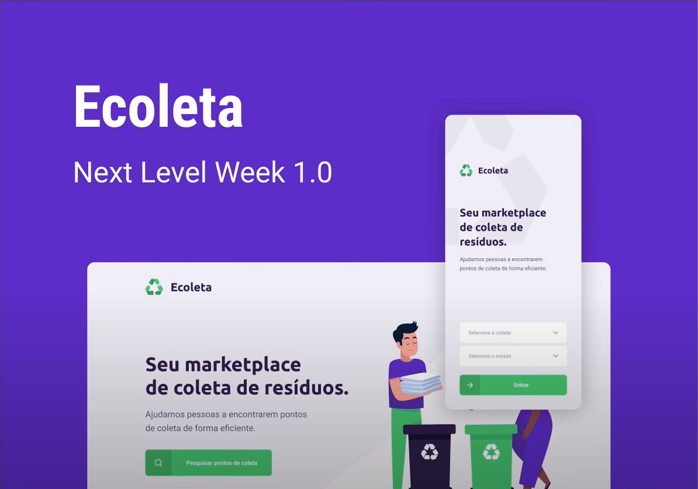

<div align="center">
  
  
  <b>Aplicação Backend, Web e Mobile para ajudar pessoas a encontrarem pontos de coleta para reciclagem!</b>

  <p>
  Recursos providos pela <a href="https://rocketseat.com.br">Rocketseat</a> na <a href="https://nextlevelweek.com/">NextLevelWeek</a>
  </p>

<!--  Shields -->
   

  

  
  <a href="https://github.com/filipebsmaia/Ecoleta/commits/master">
    
  </a>

  <a href="https://github.com/filipebsmaia/Ecoleta/issues">
    
  </a>

  
<!--  Shields -->
</div>
</br>
<div align="center">
  

</div>

# Índice

- [Sobre](#sobre)
- [Tecnologias Utilizadas](#tecnologias)
- [Como Usar](#como-usar)
- [Como Contribuir](#como-contribuir)

<a id="sobre"></a>

## :bookmark: Sobre

<p>
O <strong>Ecoleta</strong> foi uma aplicação desenvolvida no evento NextLevelWeek ministrado pela rocketseat. O objetivo da aplicação é ajudar pessoas a encontrarem pontos de coleta para reciclagem.
<p>

Essa aplicação foi construída na trilha Booster A ideia de criar uma aplicação voltada ao meio ambiente surgiu da coincidência da data do evento com a data da semana do meio ambiente.

<a id="tecnologias"></a>

## :rocket: Tecnologias

O projeto foi desenvolvido utilizando as seguintes tecnologias:

- [TypeScript](https://www.typescriptlang.org/)
- [Node.js](https://nodejs.org/en/)
- [ReactJS](https://reactjs.org/)
- [React Native](https://reactnative.dev/) utilizando [Expo](https://expo.io/)
- [Express](https://expressjs.com/)
- [Knex](http://knexjs.org/)
- [Multer](https://www.npmjs.com/package/multer)
- [Celebrate](https://www.npmjs.com/package/celebrate)
- [Axios](https://github.com/axios/axios)
- [Leaflet](https://leafletjs.com/)
- [React Navigation](https://reactnavigation.org/)
- [React Native Gesture Handler](https://kmagiera.github.io/react-native-gesture-handler/)

<a id="como-usar"></a>

## :information_source: Como usar

- ### **Pré-requisitos**

Para clonar a aplicação você ira precisar do [Git](https://git-scm.com), [Node.js v12.16.3](https://nodejs.org/) ou maior + [Yarn v1.17.3](https://yarnpkg.com/) ou maior instalado em seu computador. Por linha de comando:

```sh
  # Clone o repósitorio
  $ git clone https://github.com/filipebsmaia/ecoleta.git

  ## Instale as dependencias e configurações do backend
  $ cd server
  $ yarn
  $ npm run knex:migrate
  $ npm run knex:seed
  $ cd ..

  ## Instale as dependencias do frontend
  $ cd web
  $ yarn
  $ cd ..

  ## Instale as dependencias do mobile
  $ cd mobile
  $ yarn global add expo-cli
  $ yarn
  $ cd ..

  ## Iniciando aplicação
  $ cd server
  $ yarn dev
  $ cd ..

  $ cd web
  $ yarn start
  $ cd ..

  $ cd mobile
  $ yarn start

```

<a id="como-contribuir"></a>

## :recycle: Como contribuir

- Faça um Fork desse repositório,
- Crie uma branch com a sua feature: `git checkout -b my-feature`
- Commit suas mudanças: `git commit -m 'feat: My new feature'`
- Push a sua branch: `git push origin my-feature`

---

<div align="center">
<h4>
    Feito com 💜 por <a href="https://www.linkedin.com/in/filipebsmaia/" target="_blank">Filipe Maia</a>
</h4>
</div>
